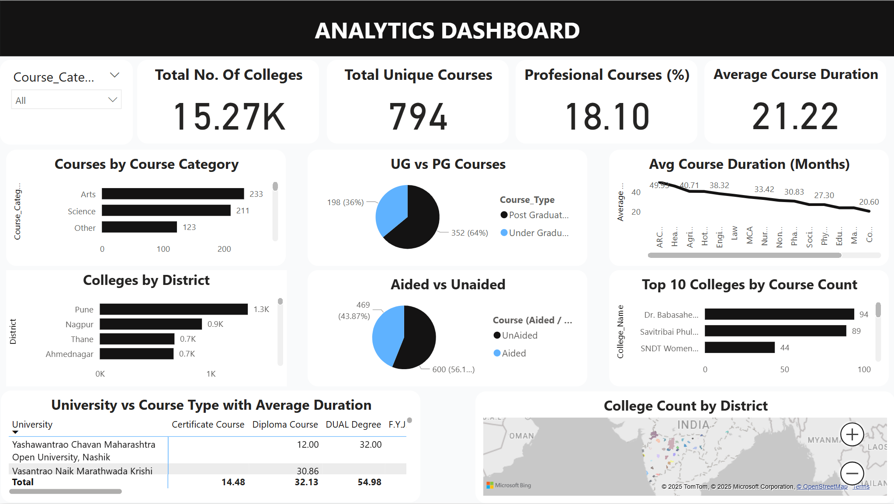

# 📊 Power BI Dashboard – Education Dataset Analysis

This is a Power BI project I completed as part of my internship at Soulvibe.Tech (Batch 10).  
It involves cleaning, transforming, and visualizing an educational dataset of 60,000+ records using Power BI.

---

## 🗂️ Dataset Overview
- Source: `DA_Batch_10_Dataset.csv`
- Records: 60,000+
- Columns: District, Taluka, College Name, College Type, University, Course Name, Type, Duration, Category
- Structure: Single flat table (no relationships)

---

## 🔧 Data Preparation & Transformation

Done in Power Query Editor (Power BI Desktop):
- Removed missing values in `College Type`
- Renamed columns for clarity
- Created `Specialization` column from `Course Name`
- Created `Duration Category` field based on months:
  - Short (<12)
  - Medium (12–36)
  - Long (>36)

---

## 📈 Dashboard Highlights

Key visuals include:
- District-wise college counts
- Course category breakdown
- Type of funding (aided vs unaided)
- Duration category analysis

All visuals are interactive and cross-filtered using slicers.

---

## 🤖 Q&A Visual Page

This page uses Power BI’s natural language Q&A feature  
(e.g., “Top 5 specializations by count” → dynamic visual generated)

---

## 🧠 Key Insights

- Pune has the highest number of colleges (1.3K+)
- Arts & Science are the most common course categories
- ITI is the most frequent specialization (82 programs)
- Most courses are unaided and non-professional

---

## 📁 Project Files

| File | Description |
|------|-------------|
| `Ajay_Kumar_Sahu_PowerBI_Task.pbix` | Power BI source file |
| `Ajay_Kumar_Sahu_PowerBI_Source File.pdf` | Documentation of transformations |
| `Ajay_Kumar_Sahu_PowerBI_Task_Presentation.pptx` | PowerPoint presentation |
| `Ajay_Kumar_Sahu_PowerBI_Task_Voiceover.mp4` | Voice-over video presentation |
| `screenshots/` | Screenshots of dashboard, transformations, Q&A |

---

## 👨‍💻 Created By

**Ajay Kumar Sahu**  
📧 [ajayksahu.in@gmail.com]  
📍 India  
🔗 [LinkedIn Profile](https://www.linkedin.com/in/17-ajay)

---
